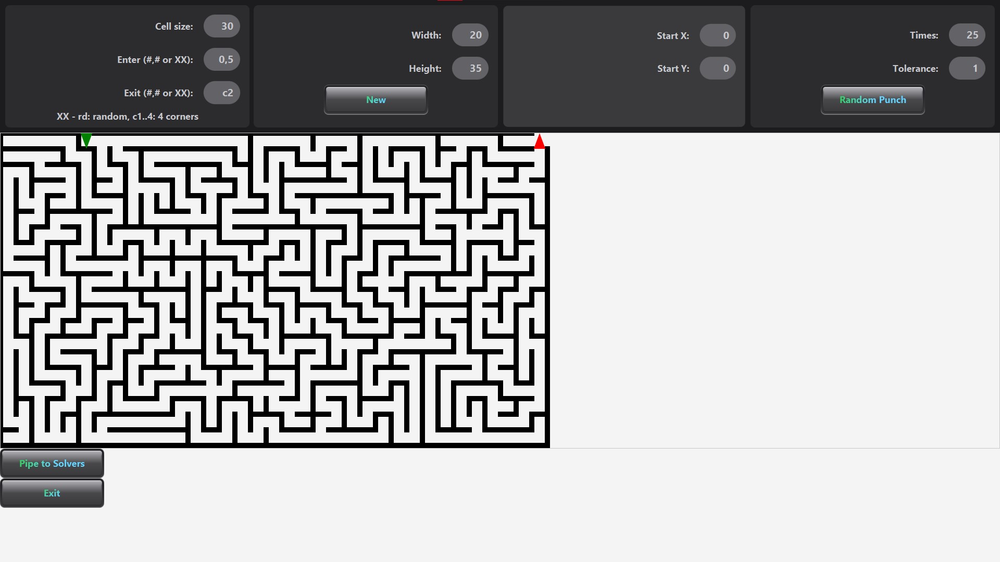

# Independent Project: MazeSolverVisualization
### Author: Truong Nguyen Huy
### Major: Computer Science - Software Engineering
#### @ University of Illinois at Chicago

An application that visualizes how diffrent graph search algorithm solve custom maze.

Client can custom make their maze (height, width, enter/exit point) using this UI. Maze is built using a DFS-based algorithm.

After a custom maze is built, this maze can be piped to the solvers where users can choose between different available solvers to see how each of them perfrom on the maze.

This application provides a solving animation and resulting stats of the selected solver.

This application also allows the client to apply 2 overlay views: exploration path of the agent and true solution path. Below is only the solution path being displayed:

